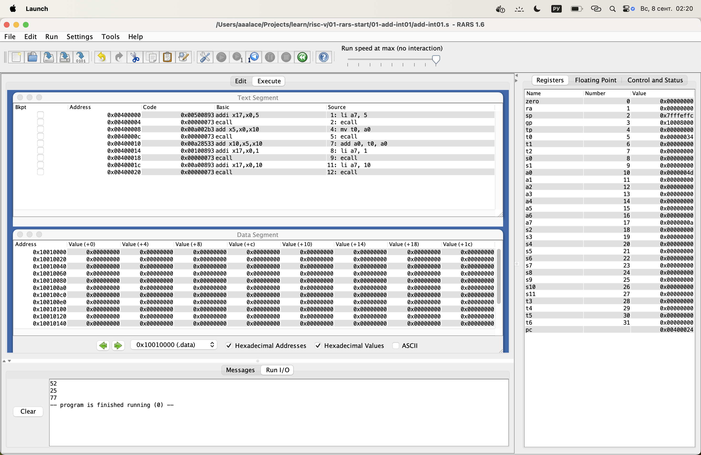
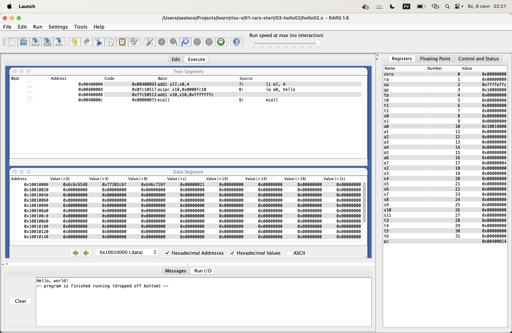
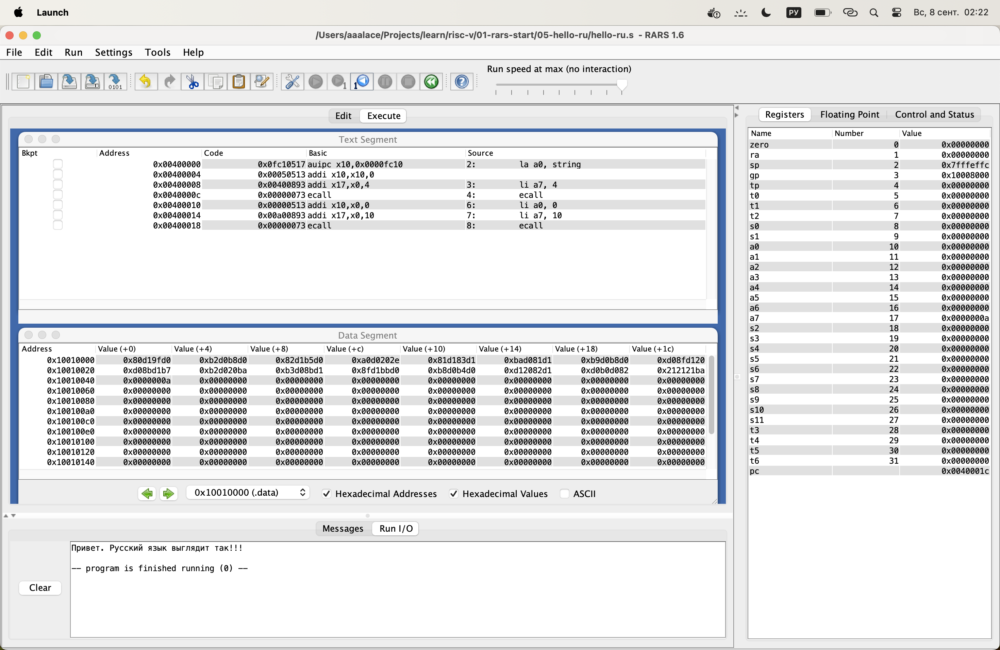
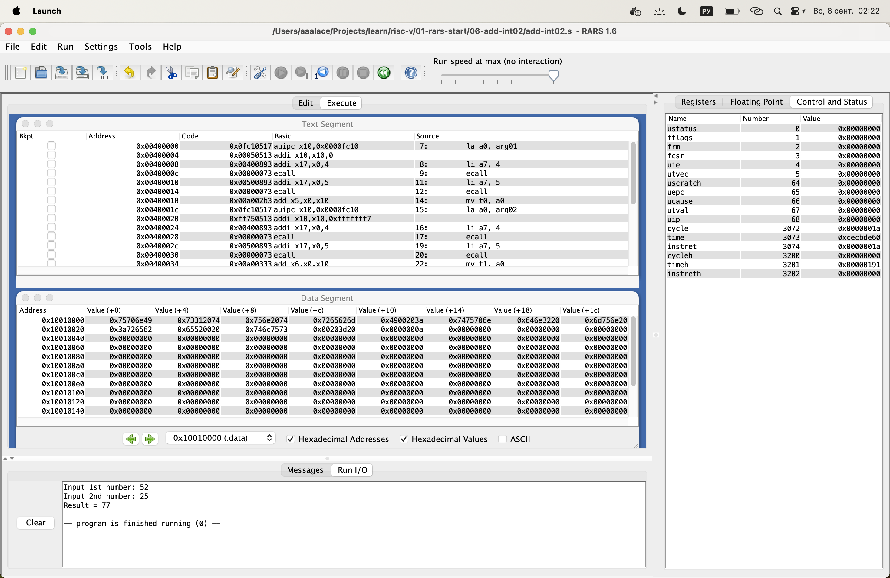

# ДЗ 1
Видео для доп баллов:
https://drive.google.com/file/d/1LmGkFjH8Ua4e9GEwCLWrhWoG2xj-Q_I5/view?usp=sharing

## №1 (add-int01.s)
### Код
```assembly
li a7, 5
ecall

mv t0, a0
ecall

add a0, t0, a0
li a7, 1
ecall

li a7, 10
ecall
```

### Системные вызовы
- 1 - вывод int из a0
- 5 - ввод int в a0
- 10 - выход из программы




## №2 (hello01.s)
### Код
```assembly
.text
    la a0, string
    li a7, 4
    ecall

    li a0, 0
    li a7, 10
    ecall

.data
    string: .asciz "Hello! It works!!!\n"
```

### Системные вызовы
- 4 - вывод string из a0 (здесь лежит ее адрес)
- 10 - выход из программы


## №3 (hello02.s)
### Код
```assembly
.data
    hello:  .asciz "Hello, world!"

.text
main:
    li a7, 4
    la a0, hello
    ecall
```

### Системные вызовы
- 4 - вывод string из a0 (здесь лежит ее адрес)




## №4 (hello03.s)
### Код
```assembly
.text
    la a0, string
    li a7, 4

.data
 	string: .asciz "Hello! It works!!!\n"

.text
    ecall

    li a0, 0
    li a7, 10
    ecall
```

### Системные вызовы
- 4 - вывод string из a0 (здесь лежит ее адрес)
- 10 - выход из программы


## №5 (hello-ru.s)
### Код
```assembly
.text
    la a0, string
    li a7, 4
    ecall
        
    li a0, 0
    li a7, 10
    ecall
.data
	string: .asciz "Привет. Русский язык выглядит так!!!\n"
```

### Системные вызовы
- 4 - вывод string из a0 (здесь лежит ее адрес)
- 10 - выход из программы




## №6 (add-int02.s)
### Код
```assembly
.data
	arg01:  .asciz "Input 1st number: "
	arg02:  .asciz "Input 2nd number: "
	result: .asciz "Result = "
	ln:     .asciz "\n"
.text
	la a0, arg01
    li a7, 4
    ecall

    li a7, 5
    ecall
    mv t0, a0

    la a0, arg02
    li a7, 4
    ecall

    li a7, 5
    ecall
    mv t1, a0

    la a0, result
    li a7, 4
    ecall

    add a0, t0, t1
    li a7, 1
    ecall

    la a0, ln
    li a7, 4
    ecall

    li a7, 10
    ecall
```

### Системные вызовы
- 1 - вывод int из a0
- 4 - вывод string из a0 (здесь лежит ее адрес)
- 5 - ввод int в a0
- 10 - выход из программы

### Типы форматов команд
- R-тип: add
- I-тип: addi
- U-тип: auipc

### Псевдокоманды
- la (load address)
- li (load immediate)
- mv (move)

